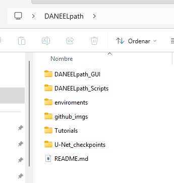

# DANEELpath: Digital image Analysis for NEuroblastoma modELs

**DANEELpath** is an open-source image analysis toolkit developed to work with neuroblastoma models. 

>[!IMPORTANT]
>  **NEW!** 
> **DANEELpath** has now a QuPath extension!
> The functionalities are the same, but the installation process is easier and all the tools are much faster. 
> You can check the extension and download it from [qupath-extension-daneelpath](https://github.com/iviecomarti/qupath-extension-daneelpath).
> 


At the moment **DANEELpath** tools are focused on obtaining data from 3D cell culture hydrogels histological slides. Nevertheless the tools can be used to work with _in vivo_ and human histological samples. 

**DANEELpath** is built to work inside [QuPath](https://qupath.github.io/), a popular software for digital pathology.

Our YouTube tutorial showing how to install  **DANEELpath** is available here:[YouTube Playlist](https://www.youtube.com/playlist?list=PLy8rOAuzr1smDChoWlHs-aqI4c4eMIJm8)

The tutorials can be downloaded tooguether with the DL model weights from INCLIVA cloud [here](https://fincliva-my.sharepoint.com/:f:/g/personal/ivieco_incliva_es/Em1Gxnm8ZqVDla9rYuZahKkBJMObubzL_paoijLSp4D2Rw?e=q7IkKm)

The original preprint, with all the details can be found [here](https://www.biorxiv.org/content/10.1101/2025.03.31.646267v1): DANEELpath: Open-source Digital analysis tools for histopathological research. Applications in NEuroblastoma modELs.  bioRxiv 2025.03.31.646267; doi: https://doi.org/10.1101/2025.03.31.646267


## What can DANEELpath do?

The neuroblastoma cells grow in cell cluster fashion inside of 3D hydrogels. Our focus is to study of the effect glicoprotein Vitronectin in the growth and progression of neuroblastoma cells.

When we do sections of the Hydrogels and do an H&E staining, we can see the clusters in a huge range of sizes. 
When we do an immunostaining against Vitronectin,  we observe a peri-cluster deposit , that we designated as Vitronectin-Corona.
However, when we grow the cells in matrices in wich we added Vitronectin, when we do the immunostaining agains Vitronectin,  a faint peri-cluster intensity appears, that we designed pale-halo.

**DANEELpath** tools have been designed to streamline the process of segmentation of cell clusters, peri-cluster structures. Furtheremore, we designed tools to obtain morphological and spatial features from cell clusters. Those tools include: 

1. Segmentation tools:

- Semantic Segmentation of cell clusters using a U-Net for H&E and Vitronectin stainings
- Pipeline for segmentation and feature extraction of peri-cluster structures.

2. Spatial feautures tools:

- Determination of center and periphery regions with equal area of a 2D shape
- Descriptors of the distances between cells nearest neighbors inside cell clusters
- Count the number of neighbors arround cell clusters, with three neighborhood criteria


## Nice but... Do I need programming experience to use DANEELpath?

You do **NOT** need programming experience to use **DANEELpath**!


We are aware that not all the users have programming experience, and we do not want this to limit **DANEELpath** use. In the *DANEELpath_GUI* folder, you will find a set of groovy scripts that, when run in QuPath, will create a Graphical User Interface to interact. 

Nevertheless, we also want to support users with more experience. In the *DANEELpath_Scripts* folder you can find the groovy script version of the tools, with the same parameters as in the GUI, which enables to run the scripts for multiple images in QuPath.


To facilitate **DANEELpath** use, we created a YouTube tutorial showing the installation process. Furthermore we provide a series of tutorials showing how to use all the tools


# INSTALLATION 

Here you will find the instructions for **DANEELpath** setup. If you have any problems, you can check our [YouTube videos](https://www.youtube.com/playlist?list=PLy8rOAuzr1smDChoWlHs-aqI4c4eMIJm8).


## 1. Install QuPath and Cellpose extension

### 1.1 QuPath

**DANEELpath** works inv **QuPath** version 0.6.0 and above. You can download **QuPath** from this link: https://qupath.github.io/

If you have  problems during **QuPath** installation, you can check this link: https://qupath.readthedocs.io/en/stable/docs/intro/installation.html

### 1.2 Install qupath-extension-cellpose 

**DANEELpath** uses a functionality inside the incredible qupath-extension-cellpose from [BIOP](https://github.com/BIOP/qupath-extension-cellpose). **DANEELpath** need the version 0.11.0 or above of the BIOP extension. 

You can follow the instructions of [qupath-extension-cellpose](https://github.com/BIOP/qupath-extension-cellpose) to install the extension using the QuPath Extension Manager. 

As alternative, you can download the extension from this [link](https://github.com/BIOP/qupath-extension-cellpose/releases) unzip the folder and drag & drop `qupath-extension-cellpose-[version].jar` onto the main QuPath window. Then restart **QuPath** (not the computer)


<u>NOTE</u>: You do not need to install Cellpose itself, just the BIOP extension `.jar` file. However, we encorage you to explore the incredible qupath-extension-cellpose. 


## 2. Download the Github Repository, the U-Net checkpoints and the tutorials. 

### 2.1 GitHub Repository
You can download the GitHub repo as `zip` folder and extract the content in the desired folder in you machine. 

If you have Git, you can create your destiny folder in your machine, open a Git Bash terminal and run the command: 

```bash
git clone https://github.com/iviecomarti/DANEELpath.git
```

By doing this, you will have all the files present in this repository. However we still need to download the weights of the models and the tutorials 

### 2.2 U-Net checkpoints and tutorials.

You can download the U-Net weights and tutorials from INCLIVA cloud here: [DANEELpath_Unets_and_Tutorials](https://fincliva-my.sharepoint.com/:f:/g/personal/ivieco_incliva_es/Em1Gxnm8ZqVDla9rYuZahKkBJMObubzL_paoijLSp4D2Rw?e=q7IkKm)

Once downloaded, unzip the folder. Inside you will find two folders: *U-Net_checkpoints* and *Tutorials*

**IMPORTANT: DO NOT CHANGE THE FOLDERS NAME**

You need to place, at least the folder *U-Net_checkpoints* to the same folder as all de files of the GitHub Repository have been downloaded. 
You should have somehting like this: 




Now that we downloaded the models, we need to do the set-up to install Miniconda and PyTorch. 


## 3. Download Miniconda and setup the PyTorch enviroment

### 3.1 Miniconda

Install **Miniconda** for you OS. You can find the instructions to install it here: https://docs.anaconda.com/miniconda/install/# 

If you have any questions, please check our YouTube video.

<u>NOTE</u>: We will show the GPU support in section 5

### 3.2 Install the enviroment and check torch installation

In **DANEELpath** folder, you will see the **enviroments** folder. Inside that folder you will find `DANEELpath_env_[OS]_CPU.yml`. You have the `.yml` files for `Windows`, `Linux` and `AppleSilicon` 

Open a Miniconda terminal and go to the **enviroments** folder where you unziped **DANELpath**. 


If you are in Windows11 you need to run the following command in the Anaconda terminal: 

```bash
conda env create -f DANEELpath_env_Windows_CPU.yml
```

This will take a little bit of time to install all the dependencies. 

When the installation finishes, we neeed to check if `torch` is installed succesfully. Open the **DANEELpath** enviroment by typing in the Anaconda terminal: 

```bash
conda activate DANEELpath
```

Then run this line of code: 

```bash
python -c "import torch; x = torch.rand(5, 3); print(x)"
```

You will see something like this in the terminal if everything goes okay: 

```bash
tensor([[0.3380, 0.3845, 0.3217],
        [0.8337, 0.9050, 0.2650],
        [0.2979, 0.7141, 0.9069],
        [0.1449, 0.1132, 0.1375],
        [0.4675, 0.3947, 0.1426]])
```

 
### 3.3 Obtain the Python path

If you are in a Windows machine run in the terminal: 

```bash
where python
```

You will obtain an output simmilar to this one if you are in Windows11:

```bash
C:\Users\User\anaconda3\envs\DANEELpath\python.exe
```

If you are in a Linux/Mac run in the terminal: 

```bash
which python
```

You will obtain an output simmilar to this one in Linux/Mac

```bash
/home/User/miniconda3/envs/DANEELpath/bin/python
```

Copy the output for **DANEELpath** `python.exe`,  and it is IMPORTANT to change the direction of the bars from `\` to `/` if you are in Windows11. The above example you need to do: `C:/Users/User/anaconda3/envs/DANEELpath/python.exe` 

For Linux and Mac, the bars are in the correct direction. Furthermore, you do not have `python.exe` after asking the path.  You should copy just: `/home/User/miniconda3/envs/DANEELpath/bin/python` 

## 4. Set the Python Path in Groovy scripts for U-Net

To be able to use the U-Nets, you will need to do a final adjustment in the semantic segmentation Scripts.

### 4.1 Change in script for DANEELpath GUI

Go to DANELpath > DANEELpath_GUI > `1.GUI_U-Net_Semantic_Segmentation`. Open the script in QuPath and you will see this piece of code at the beggining of the script:

```groovy
//Python conda settings
def pythonElements() {
    
    def daneelFolder = "path/DANEELpath/folder"
    def pathPythonEnviromentEXE = "path/python.exe"
    
    return [modelsFolder:danelFolder,exePath:pathPythonEnviromentEXE]
    
}

```

In `daneelFolder` put the path where you downloaded DANEELpath. **IMPORTANT**: you must put the separators in this direction `/`
In `pathPythonEnviromentEXE` put the `python.exe` path that you obtained in 3.3. **IMPORTANT**: you must put the separators in this direction `/`

Save the groovy script.

### 4.1 Change in script for DANEELpath Script

Go to DANELpath > DANEELpath_Scripts > 1.Semantic_Segmentation > `1.1.Run_U-Net_Script`. Open the script in QuPath and you will see this piece of code at the beggining of the script:

```groovy
//Python conda settings
def danelFolder = "path/DANEELpath/folder"
def pathPythonEnviromentEXE = "path/python.exe"

```

In `daneelFolder` put the path where you downloaded DANEELpath. **IMPORTANT**: you must put the separators in this direction `/`
In `pathPythonEnviromentEXE` put the `python.exe` path that you obtained in 3.3. **IMPORTANT**: you must put the separators in this direction `/`

Save the groovy script.

**Now you can use DANEELpath!**


## 5.OPTIONAL: NVIDIA GPU for Windows11 and Linux

We can take advantage of NVIDIA GPU acceleration for inference in DANEELpath. The U-Net fits in a 4GB VRAM GPU, so there is no need of huge investment. However to achieve this we need to do the setup for CUDA. 

### 5.1 Download the NVIDIA drivers for you GPU

If you consider to use GPU, probably you have already done this step before. But just in case, make sure you have your GPU drivers updated.

You can find your the drivers for the GPU in this web: https://www.nvidia.com/en-us/drivers/

Put the characteristics of the GPU, download, and install the drivers


### 5.2 Install PyTorch with CUDA. 

The enviroment for DANEELpath installs torch without CUDA support. The easiest way to achieve the GPU support is to uninstall this version of torch and install the version with GPU. Follow the steps:
 
1. activate the enviroment: 

 ```bash
conda activate DANEELpath
```

2. Remove torch CPU: 

 ```bash
pip uninstall torch
```

3. Install torch GPU. Here we tested CUDA 11.8 and works with Python 3.10. 

 ```bash
pip3 install torch torchvision torchaudio --index-url https://download.pytorch.org/whl/cu118
```

4. Check if PyTorch detects GPU by running this command

 ```bash
python -c "import torch; print(f'CUDA Available: {torch.cuda.is_available()}, Devices: {[torch.cuda.get_device_name(i) for i in range(torch.cuda.device_count())] if torch.cuda.is_available() else None}')"
```

You should obtain a result like this one: 

```python
CUDA Available: True, Devices: ['NVIDIA GeForce RTX 4070 Ti SUPER']
```


# CITATION

## If you use DANEELpath, you need to cite the following references: 

Bankhead, P. et al. QuPath: Open source software for digital pathology image analysis. Scientific Reports (2017). https://doi.org/10.1038/s41598-017-17204-5

Burri O, Sobolewski P, Fehlmann T. BIOP:qupath-extension-cellpose. 2024  Available from: https://zenodo.org/records/13752036

## And also our reference 

Vieco-Martí et al. DANEELpath: Open-source Digital analysis tools for histopathological research. Applications in NEuroblastoma modELs. bioRxiv 2025.03.31.646267; doi: https://doi.org/10.1101/2025.03.31.646267


# ISSUES

If you find any problems using **DANEELpath** please open an **issue**. We will look at it as soon as possible  😊
